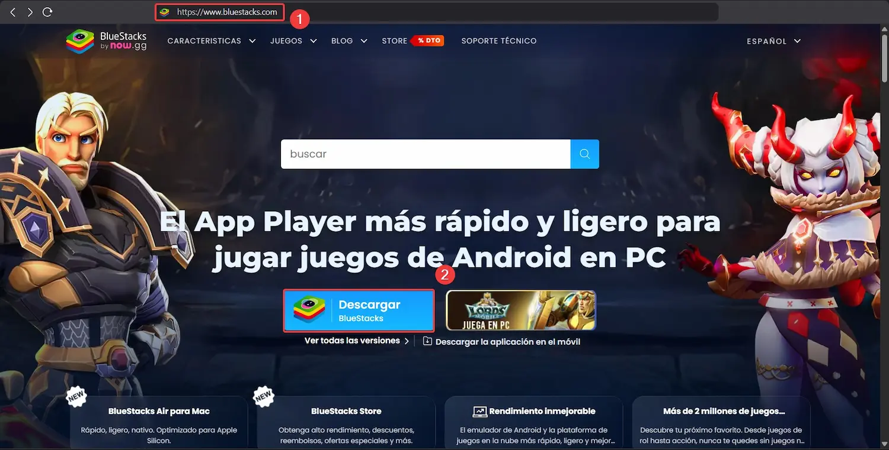
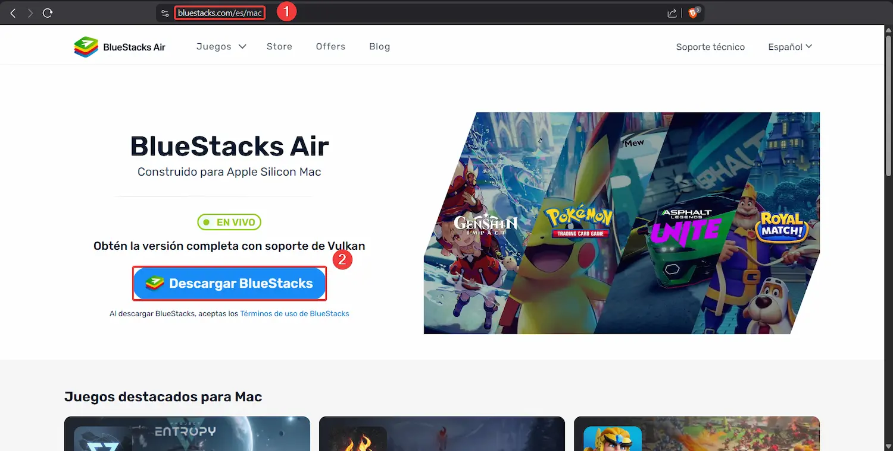
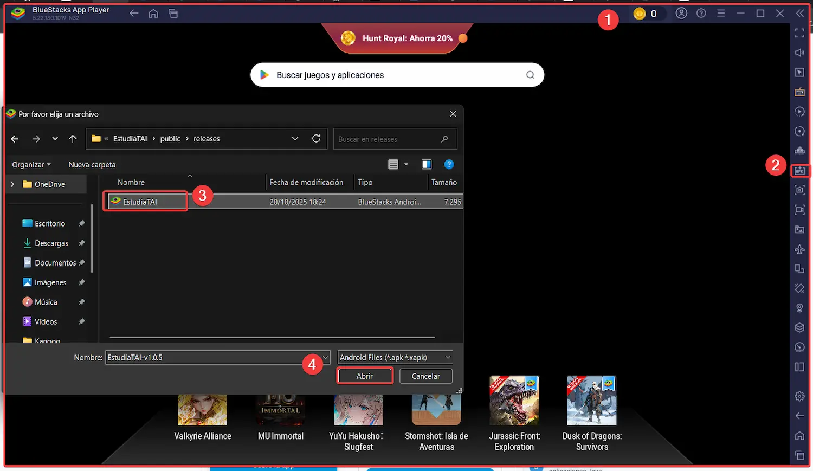
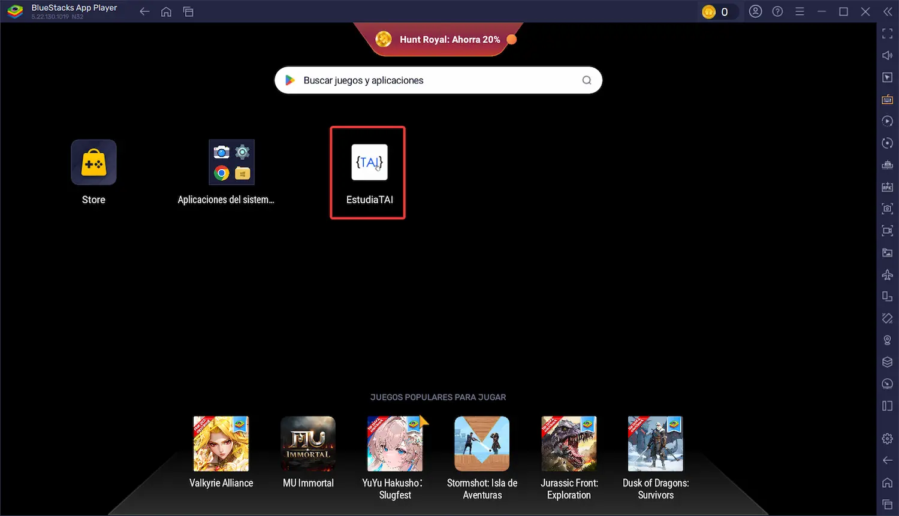

# 💻 Tutorial para usar la app en Escritorio

Este tutorial te guiará paso a paso para **instalar y usar la app de EstudiaTAI** descargando el archivo APK desde su sitio web y ejecutándola con **BlueStacks** en tu ordenador.

---

## Usar la APK en una ordenador (Windows o Mac) con BlueStacks

> BlueStacks es un emulador de Android que te permite ejecutar aplicaciones móviles directamente en tu ordenador.

### 🔹 Paso 1: Descargar la APK

1. Ve a la página oficial: [estudiatai.es](http://estudiatai.es/)
2. Busca el enlace de **"Descarga directa"** del archivo `.apk`
3. Descarga el archivo APK a una carpeta fácil de localizar (por ejemplo: tu Escritorio o Descargas)

### 🔹 Paso 2: Instalar BlueStacks

#### 💻 En Windows

1. Accede a [bluestacks.com](https://www.bluestacks.com)
2. Haz clic en **Descargar BlueStacks para Windows**
3. Ejecuta el instalador y sigue los pasos que te indica el instalador para seguir el proceso

#### 🍏 En macOS

1. Accede a [bluestacks.com](https://www.bluestacks.com/es/mac)
2. Haz clic en **Descargar BlueStacks para macOS**
3. Abre el archivo `.dmg` descargado y sigue los pasos que te indica el instalador para seguir el proceso
4. Es posible que tengas que dar permisos desde **Preferencias del Sistema > Seguridad y privacidad**

### 🔹 Paso 3: Instalar la APK en BlueStacks

1. Abre BlueStacks
2. En la pantalla de inicio, haz clic en el ícono de **Instalar APK** (ícono de flecha hacia abajo o en la barra lateral derecha)
3. Busca el archivo `.apk` que descargaste
4. Haz doble clic o selecciona “Abrir” para instalar

> La app aparecerá como un ícono en el menú de BlueStacks. Haz clic para usarla.

